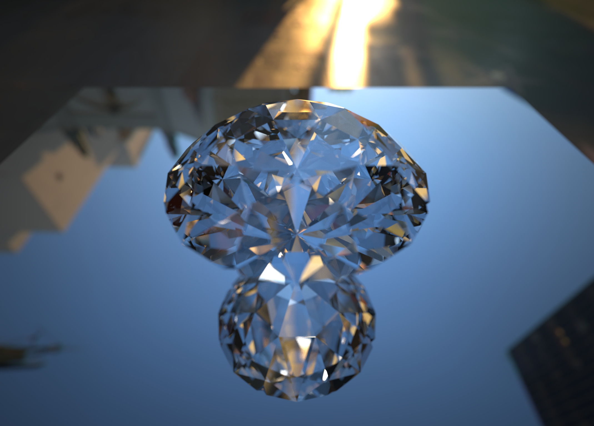

# raytracer2.5
Physically Based Ray Tracer

## Feature
* Path Tracing
* Analytic Sphere and Triangle Meshes
* Wavefront .obj file
* Bounding Volume Hierarchy(BVH) Acceleration
* Image Based Lighting
* Thin-Lens Camera Model(Depth of Field)
* Diffuse, Mirror, Glass, Phong Material
* Explicit Light Sampling Path Tracing

## Examples

